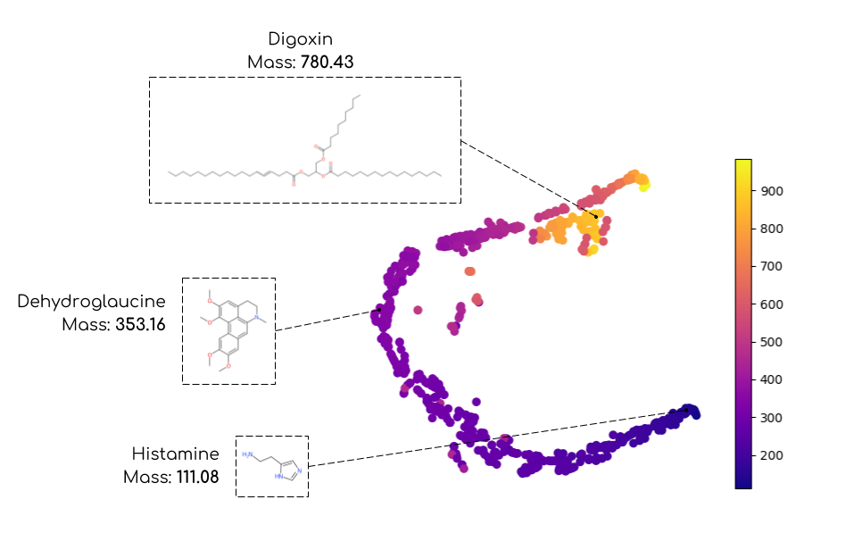

# Wasserstein Mass Spectrometry

This software is a non-official implementation of the paper 
"The Wasserstein Distance as a Dissimilarity Measure for Mass Spectra with Application to Spectral Deconvolution"
by S. Majewski, M. A. Ciach, M. Startek, W. Niemyska, B. Miasojedow and A. Gambin.

Default solver is based on a problem-specific genetic algorithm.
This allows for numerical stability and high speed.


*Figure: t-distributed Stochastic Neighbor Embedding of MS1 ESI-QTOF spectra
with precomputed matrix Wasserstein distances. The colormaps
gives the mass of each molecule (point) expressed in Daltons.*

### How to use it

Run mass spectral deconvolution algorithm on an empirical spectrum and a folder
containing the theoretical spectra. Paths to theoretical spectra should be
specified in molecule_list.txt.
A concrete example of dataset is provided in example-msd/ folder.

```
deconvms path/to/empirical/spectrum.txt path/to/molecule_list.txt path/to/molecules/folder --niter 50000
```

Compute Wasserstein dissimilarity between two mass spectra:

```
wassms path/to/first/record/file.txt path/to/second/record/file.txt --m W
```
Compute Euclidean distance between two mass spectra:

```
wassms path/to/first/record/file.txt path/to/second/record/file.txt --m E
```

### Installation

Compile the project with g++:

```
make release
```

This will create the two executable files wassms and deconvms.

### Dependencies

The project is built on top of Eigen, whose path is assumed
to be stored in a Eigen3_DIR variable.
